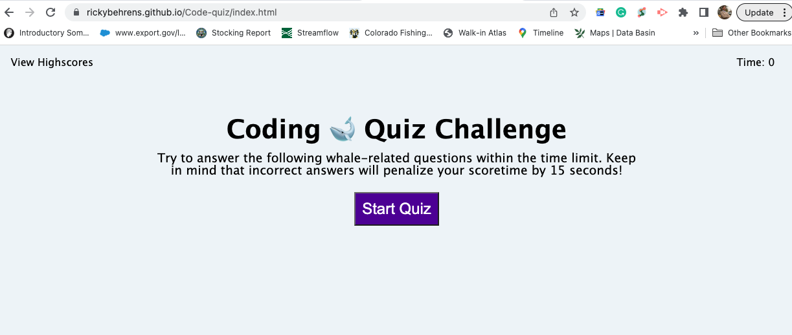
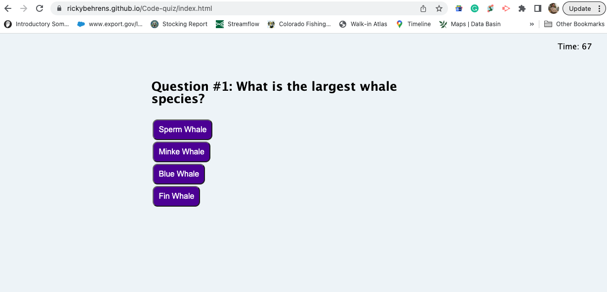
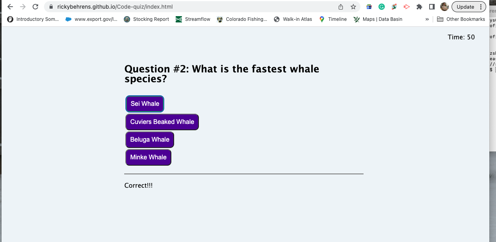
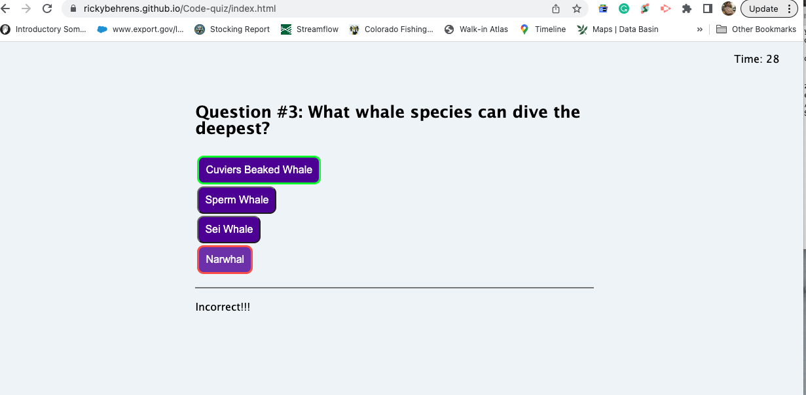
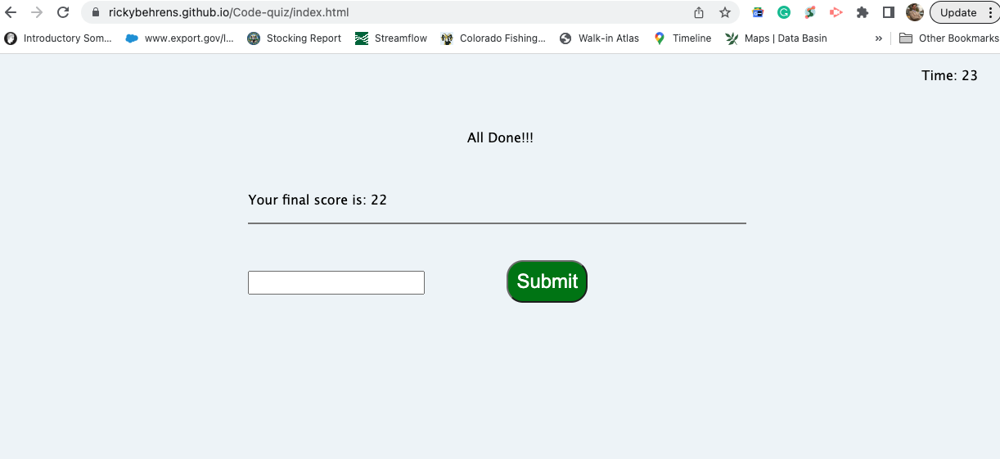
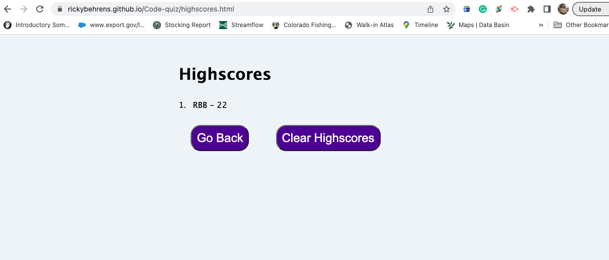
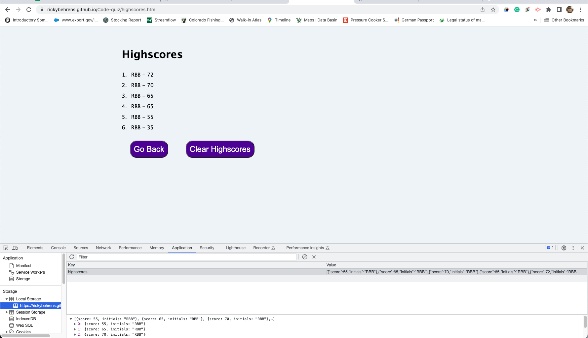

# Code-quiz
04 Web APIs: Code Quiz

## Link to the deployed URL
https://rickybehrens.github.io/Code-quiz/index.html

## Quiz Info

```
On the Home Page, you find a link in the upper left corner that will take you to the locally sotred highest scores. The timer which it's set at 0 seconds and a brief explanation on how to quiz works.

The following quiz is formed by 5 questions about whale species. Each question will have 4 choices that appear in random order every time the quiz is started and there's only 1 correct answer. Once you click the "Start Quiz" button, the timer will go to 75 an will immediatelly start counting down to 0. At the same time, the first question will appear in your screen with the possible choices.

Once the user has selected his choice, the time will stop for 3 seconds and two actions will happen given if the selected button was the correct or incorrect answer:

    * Correct answer:   ** The button will have a green border around it
                        ** A sound will indicate that you've chosen correctly
                        ** The following word will appear below "CORRECT!!!"

    * Incorrect answer: ** The button will have a red border around it
                        ** The correct choice will have a green border around it
                        ** A sound will indicate that you've chosen incorrectly
                        ** 15 seconds will be deducted from your timer
                        ** The following word will appear below "INCORRECT!!!"

The only way to loose in this quiz is if your time runs out. If you take too long to read and asnwer these 5 question, the timer will run down from 75 seconds all the way down to 0 and you will get an alert saying "Game Over!!! Time is Up!!!" which then it will take you to the Highscores page without the ability to record your initials.

Also remember that if you answer a question incorrectly, you will get a deduction of 15 seconds on your timer and if by answering many questions incorrectly, your timer hits 0 seconds left, you will also get an alert saying "Game Over!!! Time is Up!!!" which in turn it will take you to the Highscores page without the ability to record your initials.
```

## Highscores

```
All scores are stored locally and are reflected in its own url. Only the top 10 highest scores are displayed in the Highscores list while the others are stored but not displayed.

The "Go Back" button will take you back to the home page of the quiz.

The "Clear Highscores" button will clear the local memory ereasing permanently all scores until that point, but not beofre asking if the user really would like to perform said action.
```

## Screen Shots of the Quiz








